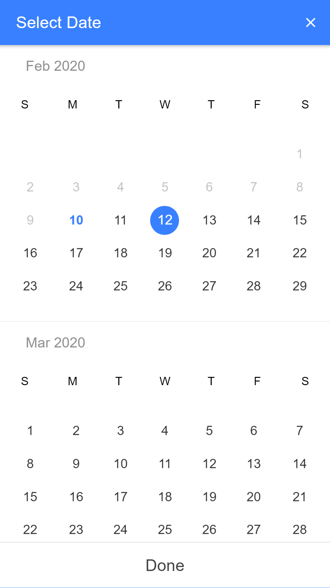

# Ionic 4 calendar using datefns library

---
title: Ionic 4 calendar 
description: Ionic 4 calendar using date-fns library in angular 8
---

## Installation
	npm install date-fns --save
	# or
	yarn add date-fns

## Supported Platforms
- Android, Ios

## Demo



### How to Use
```
//app.module.ts and page module
import { CalendarModule } from 'libs/ionic4calenderlib';
@NgModule({
...
imports: [
    CalendarModule
  ],
  ...})
  
//  home.page.ts
  import { Component } from '@angular/core';

import { 
  CalendarModal,
  CalendarModalOptions,
  CalendarResult
 } from 'libs/ionic4calenderlib';
import { ModalController } from '@ionic/angular';
@Component({
  selector: 'app-home',
  templateUrl: 'home.page.html',
  styleUrls: ['home.page.scss'],
})
export class HomePage {

  date: string;
  type: 'string'; // 'string' | 'js-date' | 'moment' | 'time' | 'object'
  selected_date = "";

  constructor(
    public modalCtrl: ModalController
  ) { }

  ngOnInit() {
    this.openCalendar();
  }

  async openCalendar() {

    const options: CalendarModalOptions = {		
      pickMode:'single', //types : single, range, multi
      monthFormat: 'MMM YYYY', // Month format for calendar component
      title: 'Select Date',   // Title of the calendar component
      doneLabel: 'Done',   // Title of the calendar component
      defaultDate: new Date(), // Default date have current date
      from: new Date(), // Current date
      to: new Date(new Date().setFullYear(new Date().getFullYear() + 1))	// Maximum one year from the current date
    };

    const myCalendar = await this.modalController.create({
      component: CalendarModal,
      componentProps: { options },
      cssClass: 'mdlBckdrp'	// Custom css
    });

    myCalendar.present();

    const event: any = await myCalendar.onDidDismiss();
    const date: CalendarResult = event.data;
    if (date !== null) {
      this.selectedDate = date.dateObj;
      this.flightAvaialbilityForm.controls['departureDate'].setValue(this.datePipe.transform(date.dateObj));
    }
  }

}


```
